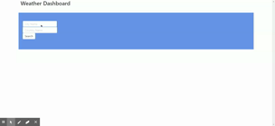

# weather-dashboard

## Deployed Website

https://kwlahr.github.io/weather-dashboard/

## Description

A real time weather dashboard sourcing information from the OpenWeather API based on user input. Index.html provides front end access to the user. Script.js file provides site functionality and API calls via AJAX to the Open Weather API.

## Technologies Used

- HTML
- CSS
- JQuery
- Open Weather RESTful API

## Implementation

- Git clone repo to local machine
- Open index.html file in browser

## Demo

